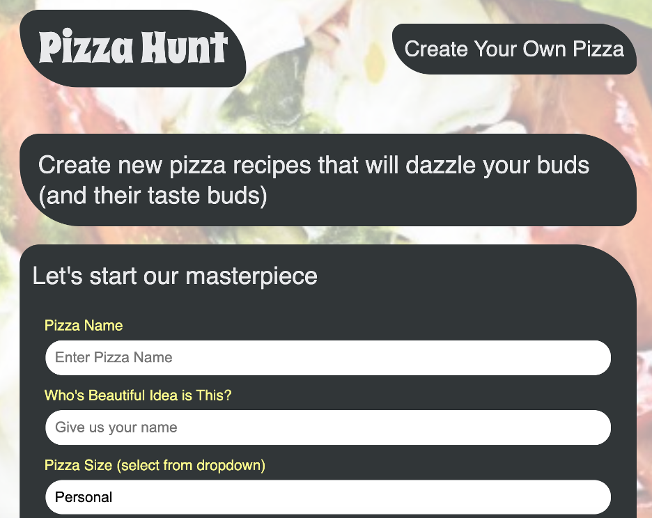

# pizza-hunt

## Description 
Check out the start of a progressive web application by using Pizza-Hunt. It is a user interactive website where people can discuss everything about pizza. As a user you can create dream pizza combinations and other users can comment on your creations, and users can reply to comments. This app utilizes MongoDB to store and structure data. 

## Table of Contents 
* [Installation](#installation)
* [Usage](#usage)
* [Credits](#credits)
* [License](#license)

## Installation 
Once on the GitHub repo, git clone to the folder on your local hardware. Once cloned, in the command line, type "npm i mongoose". Also ensure your computer has MongoDB downloaded, and follow the download prompts from the MongoDB website. 

## Usage 
Once the packages are downloaded, in the terminal you can type "npm start" or "node server.js" to start the server. You can navigate to Heroku through the link below or you can access the webpage through the localhost:3001 URL. To have a complete remote access experience, Heroku is recommended. 

Heroku Link:

## https://still-cliffs-90288.herokuapp.com/

    
## Credits 
UofA Coding Bootcamp

## License 
Node.js, Mongoose, MongoDB, Heroku, IndexedDB

## Contributing 
There are no contributions at this time. 

## Tests 
There are no tests at this time. 